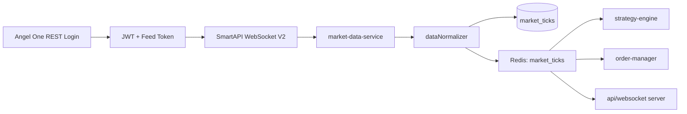
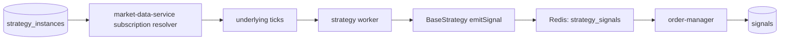
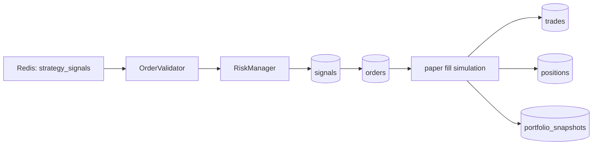
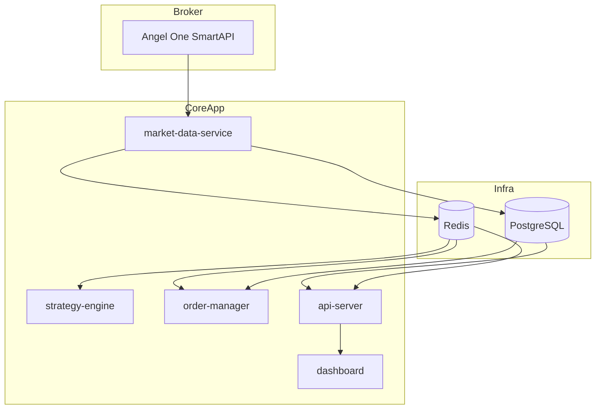

# Algo Trading Platform Architecture

This document describes the current backend architecture in `/home/server/Downloads/AlgoTrading-Node` as implemented today.

## Stack

- Runtime: `Node.js`
- Language: `JavaScript`
- API: `Express`
- Dashboard: `Next.js`
- Database: `PostgreSQL`
- Event bus / hot state: `Redis`
- Container runtime: `Docker Compose`
- Broker integration: `Angel One SmartAPI`
- Market feed: `SmartAPI WebSocket V2`
- Trading mode currently validated: `paper`

## Top-Level Structure

```text
src/
  api/                    HTTP API and websocket-facing routes
  core/
    eventBus/             Redis publisher/subscriber/client
    logger/               Winston-based logging
    utils/                time, ids, totp, helpers
  database/
    migrations/           SQL schema and data migrations
    postgresClient.js     pg pool and query helper
    seed.js               initial seed data
  execution/
    broker/               Angel One REST broker client
    orderManager/         OMS, validation, queue, paper fill persistence
  marketData/             SmartAPI V2 feed, tick normalization, subscriptions
  portfolio/              position, pnl, margin helpers
  risk/                   risk manager, exposure, circuit breaker, margin calc
  strategies/             BaseStrategy + strategy implementations
  strategyEngine/         strategy loader, worker runtime, mapping
  dashboard/              Next.js operator UI
```

## Running Services

Current Compose services from [docker-compose.yml](/home/server/Downloads/AlgoTrading-Node/docker/docker-compose.yml):

- `postgres`
- `redis`
- `market-data-service`
- `strategy-engine`
- `order-manager`
- `api-server`
- `dashboard`
- `risk-engine` is optional/incomplete
- `broker-gateway` is optional/incomplete

Important current deployment note:
- `market-data-service` runs with `network_mode: host`
- reason: Angel One HTTPS/WebSocket connectivity worked from host network but timed out from the default Docker bridge path

## Service Responsibilities

### `market-data-service`

Primary files:
- [marketDataService.js](/home/server/Downloads/AlgoTrading-Node/src/marketData/marketDataService.js)
- [angelWebsocket.js](/home/server/Downloads/AlgoTrading-Node/src/marketData/angelWebsocket.js)
- [dataNormalizer.js](/home/server/Downloads/AlgoTrading-Node/src/marketData/dataNormalizer.js)
- [instrumentManager.js](/home/server/Downloads/AlgoTrading-Node/src/marketData/instrumentManager.js)

Responsibilities:
- login to Angel One REST using API key, client code, password, and TOTP
- open SmartAPI WebSocket V2 with JWT + feed token
- maintain live subscriptions for only active strategy underlyings
- normalize incoming ticks
- persist ticks into `market_ticks`
- publish ticks onto Redis channel `market_ticks`

Current subscription model:
- reads `running` and `paused` `strategy_instances`
- extracts symbols from instance parameters, then strategy parameters
- resolves symbols through the `instruments` table
- refreshes subscriptions periodically

### `strategy-engine`

Primary files:
- [workerManager.js](/home/server/Downloads/AlgoTrading-Node/src/strategyEngine/workerManager.js)
- [strategyLoader.js](/home/server/Downloads/AlgoTrading-Node/src/strategyEngine/strategyLoader.js)
- [clientStrategyMapper.js](/home/server/Downloads/AlgoTrading-Node/src/strategyEngine/clientStrategyMapper.js)
- [baseStrategy.js](/home/server/Downloads/AlgoTrading-Node/src/strategies/baseStrategy.js)

Responsibilities:
- load strategy classes from `src/strategies/*`
- restore active strategy instances from DB
- subscribe to Redis `market_ticks`
- route ticks to matching strategies by symbol
- emit strategy signals to Redis `strategy_signals`

Cadence model:
- tick stream is universal input
- each strategy instance can evaluate on `tick`, `1m_close`, or `5m_close`
- `strategy1` currently uses `1m_close`

### `order-manager`

Primary files:
- [orderManager.js](/home/server/Downloads/AlgoTrading-Node/src/execution/orderManager/orderManager.js)
- [orderValidator.js](/home/server/Downloads/AlgoTrading-Node/src/execution/orderManager/orderValidator.js)
- [orderQueue.js](/home/server/Downloads/AlgoTrading-Node/src/execution/orderManager/orderQueue.js)
- [paperPortfolioWriter.js](/home/server/Downloads/AlgoTrading-Node/src/execution/orderManager/paperPortfolioWriter.js)

Responsibilities:
- consume `strategy_signals`
- validate dedupe, shape, and order constraints
- run risk checks
- create DB `signals` and `orders`
- simulate paper fills
- persist `trades`, update `positions`, write `portfolio_snapshots`
- publish order and position events to Redis

Current execution truth:
- paper mode is the validated path
- live broker order execution is not yet trusted/validated

### `api-server`

Primary file:
- [server.js](/home/server/Downloads/AlgoTrading-Node/src/api/server.js)

Responsibilities:
- expose REST routes for health, auth, market, orders, strategies, portfolio
- protect non-public routes with token auth middleware
- read persisted DB truth for dashboard/operator clients

### `dashboard`

Primary files:
- [app/page.js](/home/server/Downloads/AlgoTrading-Node/src/dashboard/app/page.js)
- [hooks/useWebSocket.js](/home/server/Downloads/AlgoTrading-Node/src/dashboard/hooks/useWebSocket.js)

Responsibilities:
- show operator state: health, signals, orders, portfolio
- still incomplete and not the primary validation surface today

## Event Bus

Primary files:
- [publisher.js](/home/server/Downloads/AlgoTrading-Node/src/core/eventBus/publisher.js)
- [subscriber.js](/home/server/Downloads/AlgoTrading-Node/src/core/eventBus/subscriber.js)

Redis channels currently used:

- `market_ticks`
- `strategy_signals`
- `order_requests`
- `validated_orders`
- `rejected_orders`
- `broker_responses`
- `trade_events`
- `position_updates`
- `system_alerts`
- `worker_heartbeats`

## Main Runtime Pipelines

### 1. Live Market Data Pipeline



### 2. Strategy Signal Pipeline



### 3. Paper OMS Pipeline



### 4. API Read Pipeline

```mermaid
flowchart LR
    A[(PostgreSQL)] --> B[api-server]
    B --> C[/api/market]
    B --> D[/api/orders]
    B --> E[/api/strategies]
    B --> F[/api/portfolio]
    B --> G[/health]
```

## Current Strategy State

Current important strategy files:
- [strategy1Core.js](/home/server/Downloads/AlgoTrading-Node/src/strategies/intraday/strategy1Core.js)
- [strategy1Live.js](/home/server/Downloads/AlgoTrading-Node/src/strategies/intraday/strategy1Live.js)
- [atmOptionResolver.js](/home/server/Downloads/AlgoTrading-Node/src/strategies/intraday/atmOptionResolver.js)

`strategy1Live` behavior:
- consumes live underlying ticks
- keeps provisional current-day OHLC state
- evaluates at `1m` candle close
- on entry resolves ATM CE contract
- emits paper-mode OMS signals

## Current Deployment Diagram



## Current Known Gaps

- `strategy1` on live feed is not yet fully validated end to end
- `live tick -> strategy signal -> OMS -> paper fill` still needs full validation
- dashboard is not yet the primary operational surface
- `risk-engine` and `broker-gateway` are not the current validated path
- some older modules still coexist with newer validated paper OMS code

## Current Source of Truth

- Business state truth: PostgreSQL
- Event transport and hot fanout: Redis
- Market feed source: Angel One SmartAPI
- Validated execution mode: paper

