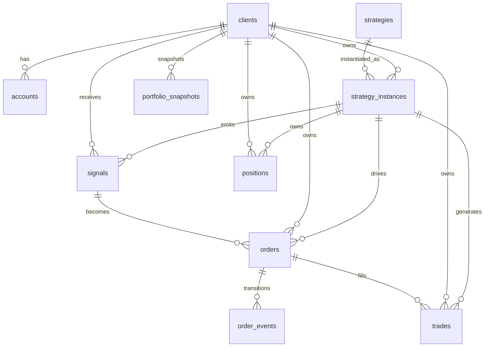
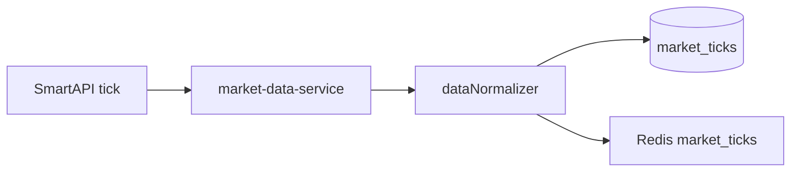
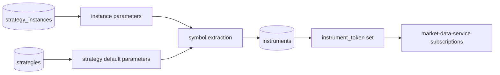
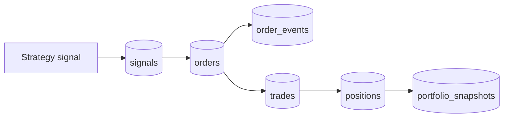

# Database Architecture

This document describes the current PostgreSQL model and DB data pipeline for `/home/server/Downloads/AlgoTrading-Node`.

## Database Role

PostgreSQL is the system of record for:

- clients
- strategy catalog
- strategy instances
- signals
- orders
- order events
- trades
- positions
- portfolio snapshots
- instruments
- market tick storage
- auth tokens and operator support tables

Redis is not the source of truth. Redis is used for event transport, fanout, and hot runtime state.

## Migrations

Current migration chain:

- [001_initial_schema.sql](/home/server/Downloads/AlgoTrading-Node/src/database/migrations/001_initial_schema.sql)
- [002_phase1_paper_oms_foundation.sql](/home/server/Downloads/AlgoTrading-Node/src/database/migrations/002_phase1_paper_oms_foundation.sql)
- [003_market_ticks.sql](/home/server/Downloads/AlgoTrading-Node/src/database/migrations/003_market_ticks.sql)
- [004_set_database_timezone_ist.sql](/home/server/Downloads/AlgoTrading-Node/src/database/migrations/004_set_database_timezone_ist.sql)
- [005_refresh_index_tokens.sql](/home/server/Downloads/AlgoTrading-Node/src/database/migrations/005_refresh_index_tokens.sql)

## Current Timezone Policy

- database session timezone: `Asia/Kolkata`
- columns use `TIMESTAMPTZ`
- stored instant remains absolute
- DB reads now render in IST, for example `2026-03-16 12:10:30+05:30`

## Core Tables

### `clients`

Purpose:
- client master records

Important columns:
- `id`
- `name`
- `email`
- `status`
- `risk_limits`

### `accounts`

Purpose:
- broker account metadata per client

Important columns:
- `client_id`
- `broker_name`
- `api_key`
- `api_secret`
- `access_token`
- `token_expiry`

### `strategies`

Purpose:
- strategy catalog / definitions

Important columns:
- `id`
- `name`
- `type`
- `file_path`
- `parameters`
- `version`

### `strategy_instances`

Purpose:
- per-client deployment of a strategy

Important columns:
- `id`
- `client_id`
- `strategy_id`
- `status`
- `parameters`
- `worker_id`
- `started_at`
- `stopped_at`
- `heartbeat_last`

Important note:
- this table is now the driver for live market-data subscriptions

### `signals`

Purpose:
- persisted strategy intent

Important columns:
- `id`
- `event_id`
- `client_id`
- `strategy_id`
- `strategy_instance_id`
- `symbol`
- `instrument`
- `action`
- `quantity`
- `price_type`
- `price`
- `status`
- `metadata`
- `rejection_reason`
- `timestamp`

### `orders`

Purpose:
- OMS order lifecycle

Important columns:
- `id`
- `client_id`
- `strategy_instance_id`
- `signal_id`
- `event_id`
- `symbol`
- `instrument`
- `side`
- `quantity`
- `price`
- `price_type`
- `status`
- `execution_mode`
- `broker_order_id`
- `filled_quantity`
- `average_fill_price`
- `rejection_reason`

### `order_events`

Purpose:
- append-only order state transitions

Important columns:
- `id`
- `order_id`
- `event_type`
- `event_data`
- `timestamp`

### `trades`

Purpose:
- actual fills, including paper fills

Important columns:
- `id`
- `order_id`
- `client_id`
- `strategy_instance_id`
- `signal_id`
- `symbol`
- `instrument`
- `side`
- `quantity`
- `price`
- `execution_mode`
- `broker_trade_id`
- `timestamp`

### `positions`

Purpose:
- current net position state per client/strategy/instrument

Important columns:
- `id`
- `client_id`
- `strategy_instance_id`
- `symbol`
- `instrument`
- `position`
- `average_price`
- `current_price`
- `unrealized_pnl`
- `realized_pnl`
- `updated_at`

### `portfolio_snapshots`

Purpose:
- summarized read model for operator/API use

Important columns:
- `id`
- `client_id`
- `total_pnl`
- `realized_pnl`
- `unrealized_pnl`
- `margin_used`
- `margin_available`
- `positions_snapshot`
- `snapshot_time`
- `created_at`

### `instruments`

Purpose:
- tradable metadata and underlying token lookup

Important columns:
- `id`
- `exchange`
- `symbol`
- `instrument_token`
- `instrument_type`
- `underlying_symbol`
- `expiry_date`
- `strike`
- `option_type`
- `lot_size`
- `is_active`
- `metadata`

Current important index tokens:
- `NIFTY 50` -> `99926000`
- `BANKNIFTY` -> `99926009`

### `market_ticks`

Purpose:
- persisted live market ticks for API reads and strategy validation

Important columns:
- `instrument_token`
- `symbol`
- `exchange`
- `ltp`
- `open`
- `high`
- `low`
- `close`
- `volume`
- `bid`
- `ask`
- `bid_quantity`
- `ask_quantity`
- `timestamp`

## Supporting Tables

- `api_tokens`
- `oauth_states`
- `operators`
- `operator_audit_log`
- `system_logs`

## Entity Relationship Diagram



## Data Pipelines

### 1. Market Data Write Path



### 2. Strategy Subscription Resolution Path



### 3. Signal to Paper OMS Path



### 4. API Read Path

```mermaid
flowchart LR
    A[(market_ticks)] --> B[/api/market]
    C[(orders)] --> D[/api/orders]
    E[(positions)] --> F[/api/portfolio]
    G[(portfolio_snapshots)] --> F
    H[(strategy_instances)] --> I[/api/strategies]
```

## Current Relationship Rules

- one `strategy_instance` belongs to one `client` and one `strategy`
- one `signal` is emitted by one `strategy_instance`
- one `order` can reference one `signal`
- one `order` can have many `order_events`
- one `order` can have one or many `trades`
- one `position` is keyed by:
  - `client_id`
  - `instrument`
  - `strategy_instance_id`
- one `portfolio_snapshot` summarizes a client portfolio at a point in time

## Current Indexing Focus

Important indexes already present:

- `signals(event_id)`
- `signals(timestamp desc)`
- `orders(status)`
- `orders(created_at desc)`
- `trades(timestamp desc)`
- `positions(client_id)`
- `strategy_instances(status)`
- `instruments(symbol)`
- `instruments(underlying_symbol)`
- `market_ticks(instrument_token, timestamp desc)`
- `market_ticks(symbol, timestamp desc)`
- `market_ticks(timestamp desc)`

## Current Database Truth for Live Trading Prep

What the database already supports well:

- strategy catalog and instances
- signal persistence
- paper OMS orders/fills
- positions and portfolio snapshots
- live market tick persistence
- instrument-based subscription resolution

What still needs more validation:

- strategy-generated live signals for `strategy1`
- live signal to paper OMS on real market ticks
- longer-running state recovery under market hours
- richer instrument master synchronization beyond current seeded index rows

## Current Design Rule

- PostgreSQL is authoritative for state and history
- Redis is for fanout and transient coordination
- operator/API reads should prefer persisted DB truth over reconstructing state from in-memory services

