# Algo Trading Platform Architecture

This document shows the current end-to-end architecture of the software in one diagram: where data comes from, how it moves through services, where it is stored, and how operators consume it.

## One Diagram

```mermaid
flowchart TB
    %% External actors
    Trader[Operator / Admin]
    BrokerREST[Angel One REST API]
    BrokerWS[Angel One SmartAPI WebSocket V2]

    %% UI and API
    subgraph AccessLayer[Access Layer]
        Dashboard[Next.js Dashboard]
        APIServer[API Server\nExpress REST API]
    end

    %% Core runtime services
    subgraph RuntimeServices[Runtime Services]
        MarketScheduler[Market Scheduler\nstart/stop feed, pause/resume strategies,\nrun end-of-day retention]
        MarketDataService[Market Data Service\nlogin, subscribe, normalize,\npersist, publish]
        StrategyEngine[Strategy Engine\nload workers, map symbols,\nprocess ticks, emit signals]
        OrderManager[Order Manager\nvalidate, risk-check, queue,\npaper fill or broker dispatch]
        RiskRuntime[Risk Components\nRiskManager, MarginCalculator,\nCircuitBreaker]
        PortfolioRuntime[Portfolio Components\nPaperPortfolioWriter,\nPosition/PnL tracking]
    end

    %% Infra
    subgraph EventBus[Redis Event Bus]
        Redis[(Redis)]
        TickChannel[[market_ticks]]
        SignalChannel[[strategy_signals]]
        ControlChannel[[market_data_control\nstrategy_control]]
        OrderEvents[[validated_orders\nrejected_orders\nbroker_responses\ntrade_events\nposition_updates\nworker_heartbeats\nsystem_alerts]]
    end

    subgraph Storage[PostgreSQL Storage]
        Clients[(clients)]
        Accounts[(accounts)]
        StrategyDefs[(strategies)]
        StrategyInstances[(strategy_instances)]
        Instruments[(instruments)]
        Signals[(signals)]
        Orders[(orders)]
        OrderEventsTable[(order_events)]
        Trades[(trades)]
        Positions[(positions)]
        Snapshots[(portfolio_snapshots)]
        MarketTicks[(market_ticks)]
        MarketOHLC[(market_ohlc_1m)]
        TickArchives[(market_tick_archives)]
        SchedulerState[(scheduler_state)]
        Operators[(operators)]
        Audit[(operator_audit_log)]
        Logs[(system_logs)]
    end

    subgraph FileStorage[File Archive]
        ArchiveFiles[(data/market-archive/*.csv)]
    end

    %% User interaction
    Trader --> Dashboard
    Dashboard --> APIServer
    APIServer --> Operators
    APIServer --> Audit

    %% Control/config path
    APIServer --> Clients
    APIServer --> Accounts
    APIServer --> StrategyDefs
    APIServer --> StrategyInstances
    APIServer --> Orders
    APIServer --> Positions
    APIServer --> Snapshots
    APIServer --> MarketTicks
    APIServer --> MarketOHLC
    APIServer -. optional live events .-> Redis

    %% Scheduler path
    MarketScheduler --> SchedulerState
    MarketScheduler --> StrategyInstances
    MarketScheduler --> ControlChannel
    MarketScheduler --> Logs

    %% Market data ingestion path
    MarketDataService --> BrokerREST
    BrokerREST --> MarketDataService
    BrokerWS --> MarketDataService
    StrategyInstances --> MarketDataService
    StrategyDefs --> MarketDataService
    Instruments --> MarketDataService
    ControlChannel --> MarketDataService
    MarketDataService --> MarketTicks
    MarketDataService --> TickChannel
    MarketDataService --> Logs

    %% Strategy processing path
    StrategyDefs --> StrategyEngine
    StrategyInstances --> StrategyEngine
    ControlChannel --> StrategyEngine
    TickChannel --> StrategyEngine
    StrategyEngine --> SignalChannel
    StrategyEngine --> OrderEvents
    StrategyEngine --> Logs

    %% OMS / execution path
    TickChannel --> OrderManager
    SignalChannel --> OrderManager
    OrderManager --> RiskRuntime
    RiskRuntime --> OrderManager
    OrderManager --> Signals
    OrderManager --> Orders
    OrderManager --> OrderEventsTable
    OrderManager --> Trades
    OrderManager --> PortfolioRuntime
    PortfolioRuntime --> Positions
    PortfolioRuntime --> Snapshots
    OrderManager --> OrderEvents
    OrderManager --> Logs
    OrderManager -. live mode only .-> BrokerREST

    %% Read path back to UI
    Orders --> APIServer
    OrderEventsTable --> APIServer
    Trades --> APIServer
    Positions --> APIServer
    Snapshots --> APIServer
    Signals --> APIServer
    StrategyInstances --> APIServer
    Instruments --> APIServer
    MarketTicks --> APIServer
    MarketOHLC --> APIServer
    Redis -. optional websocket / streaming layer .-> APIServer

    %% Retention path
    MarketTicks --> MarketScheduler
    MarketScheduler --> ArchiveFiles
    MarketScheduler --> MarketOHLC
    MarketScheduler --> TickArchives
```

## How To Read It

- `Angel One REST API` is used for login/session token workflows and, in non-paper mode, broker order placement.
- `Angel One SmartAPI WebSocket V2` is the live market feed source.
- `Market Data Service` is the ingestion boundary. It resolves active instruments from `strategy_instances` + `strategies`, normalizes ticks, stores raw ticks in `market_ticks`, and publishes them to Redis `market_ticks`.
- `Strategy Engine` consumes `market_ticks`, loads strategy classes from `src/strategies`, evaluates active strategy instances, and emits `strategy_signals`.
- `Order Manager` consumes signals, runs validation and risk checks, writes `signals`, `orders`, `order_events`, `trades`, `positions`, and `portfolio_snapshots`, then publishes execution/portfolio events back to Redis.
- `PostgreSQL` is the long-term source of truth. `Redis` is the low-latency event transport between services.
- `Market Scheduler` controls trading-day runtime state and performs end-of-day retention: raw `market_ticks` are archived to CSV, summarized into `market_ohlc_1m`, and tracked in `market_tick_archives`.
- `API Server` is the operator-facing read/write boundary used by the `Dashboard`.

## Current Source Of Truth

- Operational state and history: PostgreSQL
- Live inter-service messaging: Redis
- External market/broker source: Angel One
- Validated execution path today: paper mode through `Order Manager`
